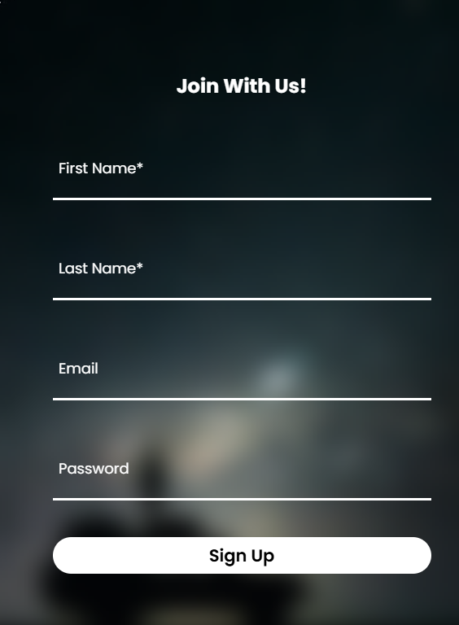
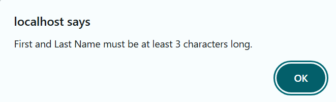

# <h1 align="center">UAS PEMROGRAMAN WEB</h1>

## Deskripsi

 
Nama: Tawakkal Rabbani Muhammad  
NIM: 122140029  
Kelas: RA  

Deskripsi Website: Website ini merupakan sebuah website Barbershop yang juga menyediakan fitur "Booking Online". Anda bisa melihat list booking, kemudian juga bisa membuat booking. Terdapat juga fitur "Sign Up" di mana ketika anda berhasil mendaftar, maka anda bisa menghapus list booking anda sendiri.

## Bagian 1: Client-side Programming

<h3 style="color: green;"> 1.1 Manipulasi DOM dengan JavaScript </h3>

<ul>
    <li> Buat form input dengan minimal 4 elemen input (teks, checkbox, radio, dll.) </li>
</ul>

  

<ul>
    <li> Tampilkan data dari server ke dalam sebuah tabel HTML. </li>
</ul>

  

<h3 style="color: green;"> 1.2 Event Handling </h3>

<ul>
    <li> Tambahkan minimal 3 event yang berbeda untuk meng-handle form pada 1.1 </li>
    <li> Implementasikan JavaScript untuk validasi setiap input sebelum diproses oleh PHP </li>
</ul>

    
    
    

## Bagian 2: Server-side Programming

<h3 style="color: green;"> 2.1 Pengelolaan Data dengan PHP </h3>

<ul>
    <li> Gunakan metode POST atau GET pada formulir. </li>
    <li> Parsing data dari variabel global dan lakukan validasi di sisi server. </li>
    <li> Simpan ke basis data termasuk jenis browser dan alamat IP pengguna. </li>
</ul>

       
    

<h3 style="color: green;"> 2.2 Objek PHP Berbasis OOP </h3>

<ul>
    <li> Buat sebuah objek PHP berbasis OOP yang memiliki minimal dua metode dan gunakan objek tersebut dalam skenario tertentu. </li>
</ul>

    
    

## Bagian 3: Database Management

<h3 style="color: green;"> 3.1 Pembuatan Tabel Database </h3>

    

<h3 style="color: green;"> 3.2 Konfigurasi Koneksi Database</h3>

    

<h3 style="color: green;"> 3.3 Manipulasi Data pada Database</h3>

    

## Bagian 4: State Management

<h3 style="color: green;"> 4.1 State Management dengan Session</h3>

<ul>
    <li> Gunakan session_start() untuk memulai session. </li>
    <li> Simpan informasi pengguna ke dalam session. </li>
</ul>

    

<h3 style="color: green;"> 4.2 Pengelolaan State dengan Cookie dan Browser Storage </h3>

<ul>
    <li> Buat fungsi untuk menetapkan, mendapatkan, dan menghapus cookie.
    
  

    </li>
    <li> Simpan informasi pengguna ke dalam session. 
    
  

    </li>
</ul>
